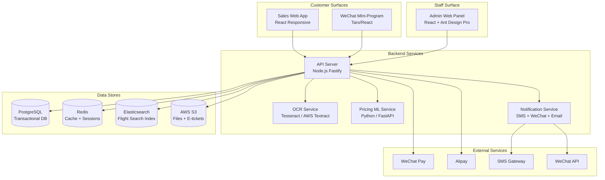
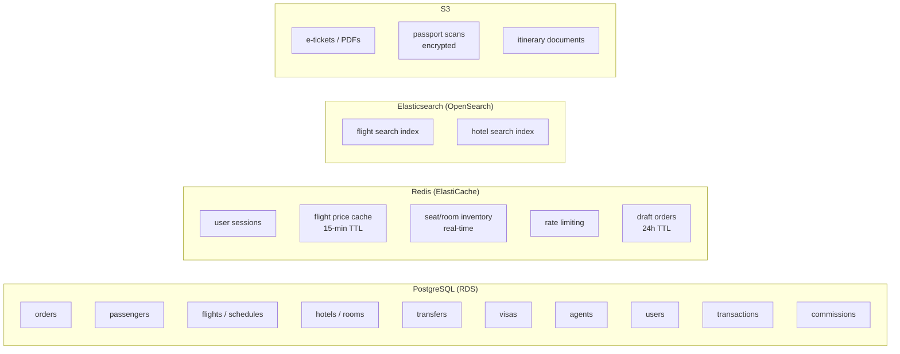
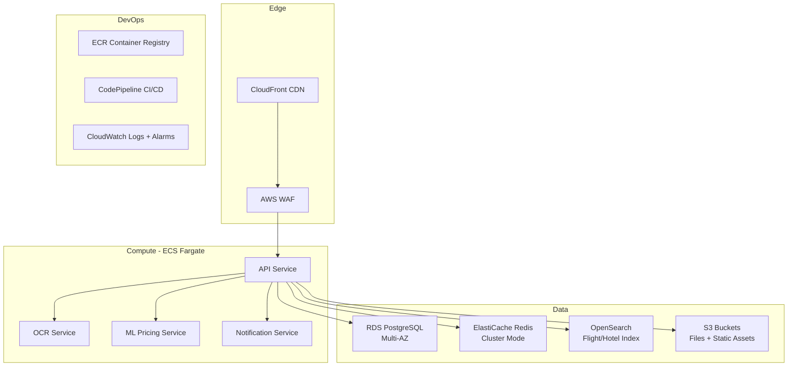
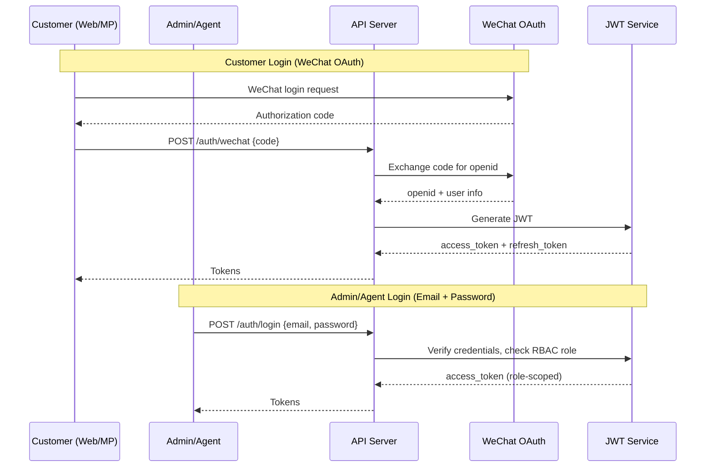
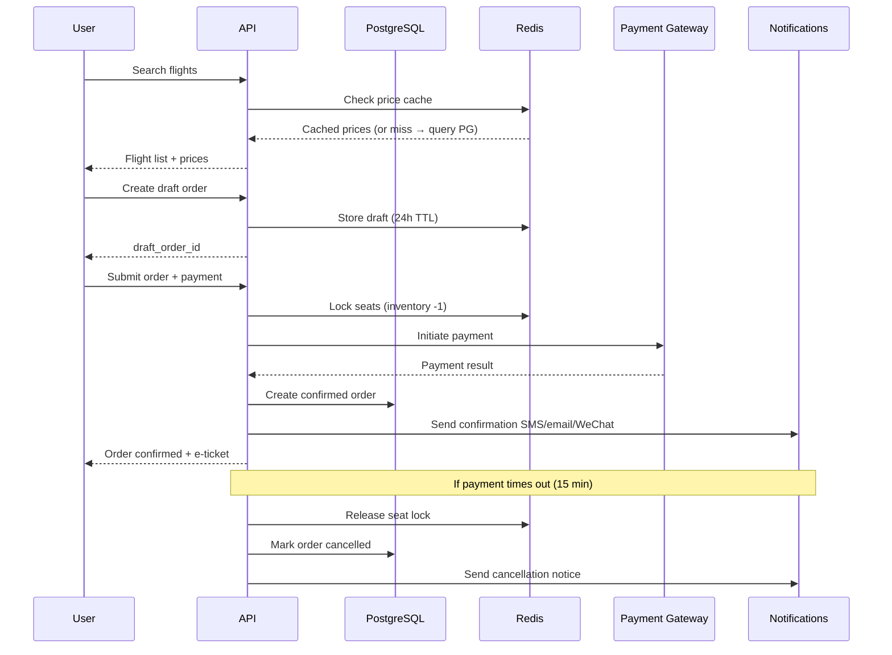

# System Architecture

## High-Level Overview



## Database Architecture

We use multiple databases — each optimized for its workload.



## AWS Deployment Architecture



## Authentication & Authorization Flow



## Order Flow



## Dynamic Pricing ML Architecture

```mermaid
graph LR
    subgraph "Data Inputs"
        HIST[Historical booking data]
        SEASON[Seasonality signals]
        COMP[Load factor / remaining seats]
        MANUAL[Manual ABCD tier overrides]
    end

    subgraph "ML Pipeline"
        PROPHET[Prophet<br/>Time-series seasonality]
        TS[Gradient Boosting<br/>Price prediction]
        TIER[ABCD Tier Engine<br/>Rule-based capping]
    end

    subgraph "Output"
        PRICE_API[Pricing API<br/>GET /pricing/{flight_id}]
        ADMIN_UI[Admin Override UI]
        CACHE[Redis price cache<br/>15-min TTL]
    end

    HIST --> PROPHET
    HIST --> TS
    SEASON --> PROPHET
    COMP --> TS
    PROPHET --> TIER
    TS --> TIER
    MANUAL --> TIER
    TIER --> PRICE_API
    TIER --> ADMIN_UI
    PRICE_API --> CACHE
```

## RBAC Permission Matrix

| Resource | Guest | Agent | Staff/Ops | Admin |
|----------|-------|-------|-----------|-------|
| Search & browse products | R | R | R | R |
| Place order | W | W | - | - |
| View own orders | R | R | R | R |
| View all orders | - | Own only | R | R |
| Process/ticket orders | - | - | W | W |
| Manage flight inventory | - | - | W | W |
| Manage hotel/transfer/visa | - | - | W | W |
| Agent accounts & prepayment | - | Own balance | - | W |
| Commission reports | - | Own | - | R |
| Dynamic pricing config | - | - | - | W |
| User/role management | - | - | - | W |
| System settings | - | - | - | W |
