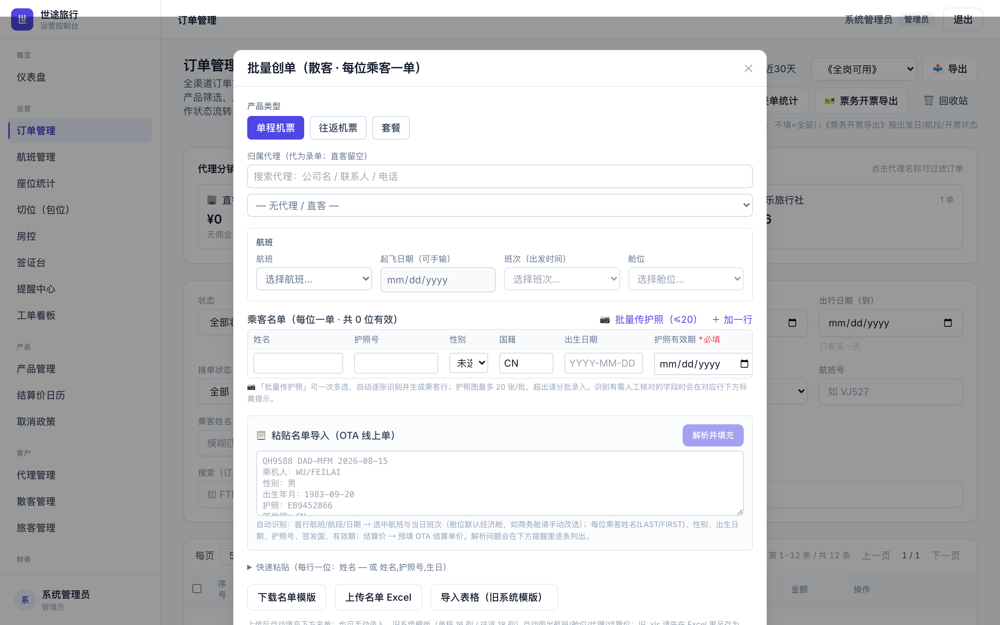
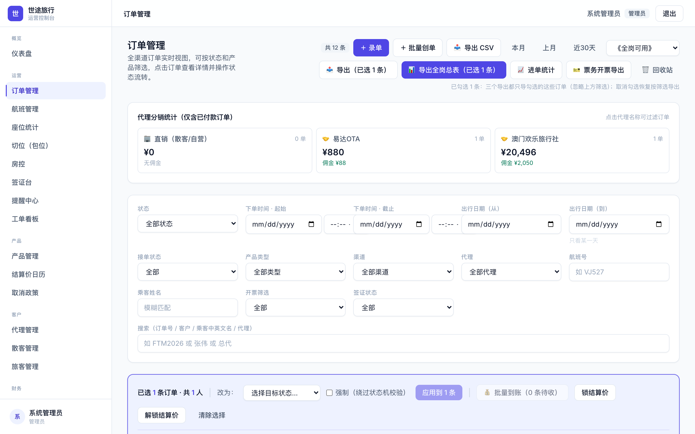
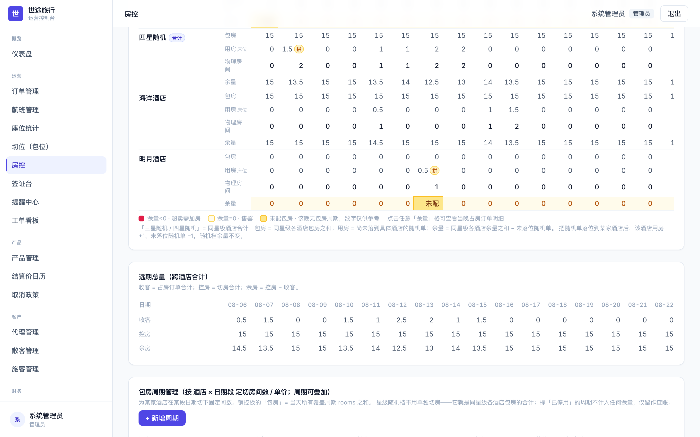
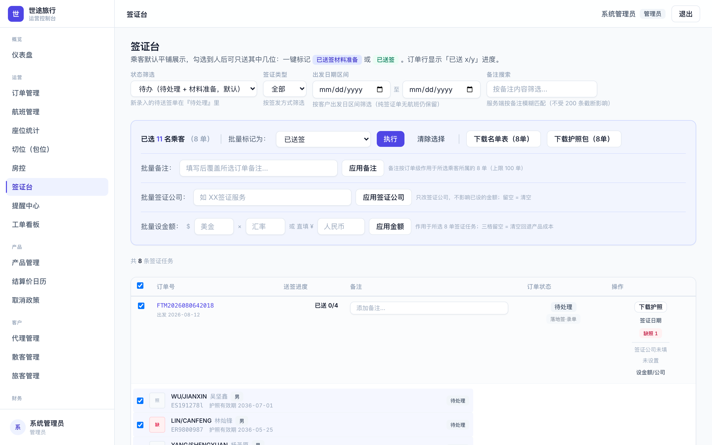
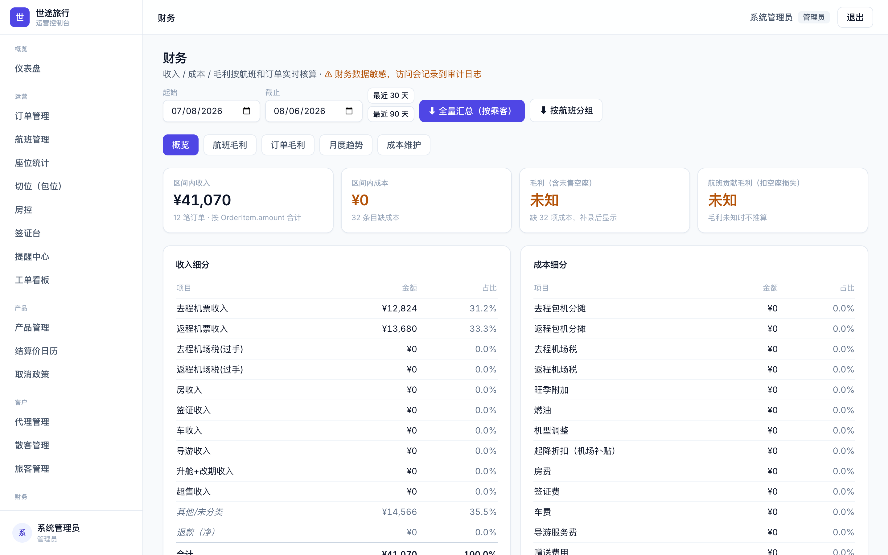
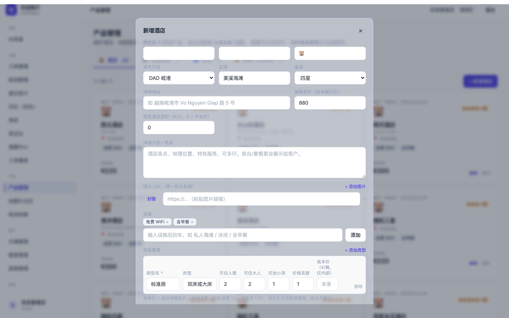
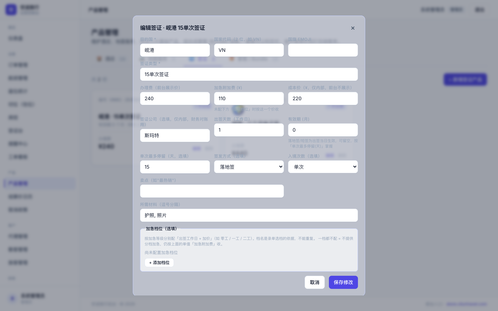
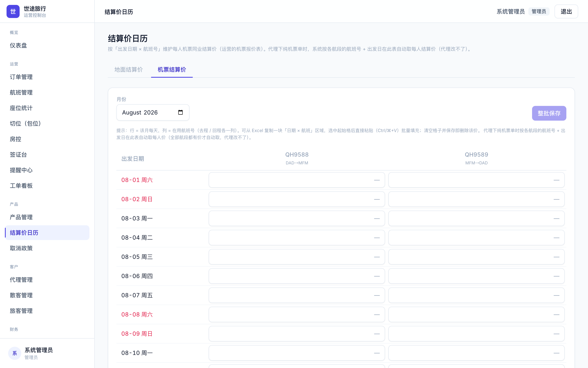

# 本次更新一览

本手册只讲**这次更新的新功能与口径变化**，配合《岗位操作说明》使用。更新已上线后台（2026-08-06）。

| 岗位 | 本次更新要点 |
|---|---|
| 全员 | 护照识别全面升级为 AI 识别；批量创单也能传护照 |
| 运营录单 | 日期自动补零；「不需要签证」一键全员自备签；升舱分去/回程；加急档位；批量创单三项增强；订单批量操作 |
| 房控 | ⚠️ **随机档口径大改：随机N星 = 同星级酒店合计**（须立即补录切房）；余量按床位口径显示 |
| 签证岗 | 「需要签证」的单能按落地签筛出；新增签证公司字段；美金自动折人民币 |
| 财务 | 美金汇率管理（按生效日）；每人结算价一目了然 |
| 票务 | 进单统计区分航班号 |
| 产品管理 | 酒店星级新增「国际五星」；签证产品可配加急档位 |
| 结算价 | 新增「机票结算价」日历，报价表可整块粘贴 |

---

# 全员必读 · 护照识别升级

**变化**：护照识别已从本地识别切换为 **AI 识别**（此前识别出乱码、姓名抓错行的问题即源于本地识别精度不足）。

- 上传护照图后自动识别姓名、护照号、性别、出生日期、有效期、签发日期等；
- 识别结果若有**需人工核对的字段**，会以黄色高亮逐项标出——请按提示核对后再提交；
- 若网络异常导致 AI 不可用，系统会退回本地识别并显示「本地识别精度有限」横幅，此时请逐项核对。

*批量创单弹窗：乘客名单区新增「批量传护照」，可一次多选逐张识别*

**批量创单现在也支持护照识别**：批量创单弹窗的乘客名单区可单张上传或一次多选批量识别（每批最多 20 张），自动生成乘客行。

---

# 运营录单

## 1. 日期不再挑格式

录单时出生日期、护照签发日期、有效期输入 `2033-8-24`、`2033/8/24` 等格式都可以，系统自动补零为标准格式；离开输入框即自动整理显示。此前「批量能录、单笔报错」的问题已修复。

## 2. 「不需要签证」一键全员自备签

套餐单在订单级签证状态选择「不需要」时，下方每位出行人的签证列会自动置为「自备签」（每人自动减免自备签金额），并显示黄色横幅说明。

- 个别乘客仍需办签的，可单独改回「随套餐」；
- 反向不联动：改回其它签证状态时，不会批量还原乘客的选择。

## 3. 套餐升舱分去程 / 回程

「升舱商务人数」拆分为**去程升舱人数**与**回程升舱人数**两个输入（单程套餐只显示去程）。只升单程按单程收费，明细显示「去程升舱×2 · 回程升舱×1」样式。

## 4. 签证加急档位

所选签证产品若配置了加急档位（如零工 / 一工 / 二工），录单时会出现「加急档位」下拉，选档后自动按该档加价并在明细中显示档名。产品未配档位时不显示此项。

## 5. 批量创单三项增强

- **护照识别**（见「全员必读」）；
- **酒店情况备注**：新增输入框，会写入本批每一张子单的酒店备注；
- **签证状态**：新增下拉，随每张子单落库（默认值按产品类型自动带出）。

**套餐批次的结算价说明**：代理套餐单按结算价日历（档次×晚数×出发日期）自动取价，**无需也不可手填**——这是防止口径漂移的既定规则。

## 6. 订单列表批量操作（勾选订单后）

*勾选订单后出现批量工具条：改状态 / 到账 / 开票之外，新增批量改签证状态、批量删除、批量选酒店*

- **批量改签证状态**：一次把所选订单改为同一签证状态；
- **批量删除**（仅管理员）：软删除、回收站可恢复；有占座未取消或已有净收款的单会被逐单拦下并列明原因；
- **批量选酒店**：把所选的「未落位随机档」订单一次性落位到指定酒店房型；非随机档订单自动跳过。

## 7. 搜索多位乘客

筛选区「乘客姓名」框现在支持一次填多个人名（用顿号、逗号或空格分隔），会列出**这些乘客各自的所有订单**。

> 与顶部搜索框的区别：搜索框填多个词是「同一订单里同时有这几个人」，用于找同行团；姓名框是「这些人的单都列出来」。

---

# 房控

## ⚠️ 上线后第一件事：补录各酒店切房周期

**随机档口径已改**：「随机三星 / 随机四星」不再是单独切的一份房，而是**同星级所有酒店切房的合计**。

> **⚠️ 重要：旧的「随机三星 20 间 / 随机四星 40 间」独立切房已停用，不再计入。**
> 当前四星合计只剩海洋酒店的 15 间。**请立即把其它各家酒店的切房周期逐一录入**（销控 · 包房周期管理 → 按酒店新增周期）。
> 不补录的后果：该星级聚合显示为「未配」，系统**不设防**，随机单下单不会被库存拦截，会直接超卖。

## 新口径下的销控矩阵

*「四星随机 · 合计」组：包房=同星级酒店合计、余量可出 .5（床位口径）；矩阵下方即「包房周期管理」，切房周期在此录入*

- 「三星随机 / 四星随机」聚合组：包房 = 同星级酒店切房合计；用房 = 尚未落位的随机单；余量 = 各酒店余量合计 − 未落位随机单。卖掉任何一家四星的房，四星随机合计即时减少（此前互不联动的问题已解决）。
- **卖随机、落位、换酒店**：客人买「随机N星」先占聚合额度；房控在订单里执行「换酒店」把单落到具体酒店后，占用转入该酒店，**合计不变**。
- 旧的独立池周期在包房周期管理里保留显示，打灰色「已停用」标记，可自行删除；「随机N星」不再提供单独切房入口。

## 余量改按床位口径

每家酒店的「余量」行 = 包房 − 用房（床位），可能出现 0.5（例如 1 位散拼客占半间）。「物理房间」行保留，仍显示实际占用的整间数；等拼的半间照旧显示「拼」角标。

---

# 签证岗

*签证台：按签证类型筛选；批量条可设签证公司与美金金额（汇率自动带出）*

## 1. 「需要签证」的单能筛出来了

签证台「签证类型」筛选选「落地签」时，凡录单时签证状态选了「需要签证」且产品未标注类型的单也会被筛出，徽章显示浅色「落地签 · 录单」（表示按录单状态推断）。「未标注」桶因此变小，属正常现象。

## 2. 新增「签证公司」字段

每条签证任务可填**签证公司**（单条填写或批量条一次应用到所选），财务对账时可按公司核对账单，不必再写进备注。

## 3. 美金自动折人民币

设金额时只需填**美金金额**——汇率一格会**自动带出财务维护的当日汇率**（可手改），人民币金额自动折算入账。已保存过金额的任务不受后续汇率调整影响。

---

# 财务

## 1. 美金汇率管理（成本页签首位新卡片）

*财务页：美金汇率按「生效日」维护*

按**生效日**维护美金汇率：如「8 月 5 日起 7.16」，之后汇率变动再加一条新记录即可，区间自动衔接。

- 签证台设金额时自动带出「≤ 当日的最新一条」汇率；
- **改汇率只影响此后的折算，已入账的任务金额不变**（每笔都固化了当时的汇率凭据）；
- ⚠️ **请先录入第一条汇率**，否则签证岗填美金时汇率框为空、需手填。

## 2. 每人结算价一目了然

订单详情「价格调整」区（乘客 ≥2 时）新增**每人结算价表**：每人 = 应收均摊 + 该乘客名下调整净额，合计恒等于订单应收。系统派生、不可手填。

> 场景示例：多人同单，其中一人后补加急签证 → 在价格调整里选中该乘客、金额 +800、原因「补收杂费」——只有这个人的每人结算价增加。

---

# 票务

## 进单统计区分航班

进单统计导出的「产品/团期」列，机票订单现在显示航班号：单程如「机票 QH9589」，往返如「机票 QH9589+QH9588」，同一天两班各自成行、人数分开统计。

---

# 产品管理

## 1. 酒店星级支持「国际五星」

*新增/编辑酒店：星级四档，含「国际五星」*

新增/编辑酒店的星级下拉现有：三星 / 四星 / 五星 / **国际五星**。国际五星与结算价日历的「国际五星」档一致，不与普通五星混淆。

## 2. 签证产品可配加急档位

*签证产品编辑：加急档位可增删（档名 / 出签工作日 / 加价）*

签证产品编辑弹窗新增「加急档位」：可增删多档（档名 / 出签工作日 / 加价），如零工、一工、二工。配置后录单即可选档收费。

> ⚠️ 请运营尽快把各签证产品的加急档位数据录入，录完录单侧即刻可用。

---

# 结算价日历

## 新增「机票结算价」页签

*机票结算价：行=日期、列=航班（与报价表同构），支持 Excel 整块粘贴*

结算价日历页面现分两个页签：**地面结算价**（原有，档次×晚数）与**机票结算价**（新增）。

机票结算价：行 = 当月每一天，列 = 各航班号（去程/回程）。**可从报价表 Excel 直接复制一块区域，选中起始格后粘贴**，批量填充后整批保存。

## 单机票代理单自动取价

代理的纯机票订单，若该航班 + 出发日期在机票结算价日历里维护了价格，下单时自动按日历生成结算价（去程按去程日期、回程按回程日期分别取价）。

- 任何一段没维护价格 → 整单放弃自动取价，按原动态定价走（宁可不取，不取错）；
- 手工填了结算价的批次，日历不介入；
- 批量创单选好航班和日期后，「结算价/人」旁会显示当前日历价作参考。

## 套餐日历取价的修正

套餐按日历取价时，升舱、单房差、婴儿价、指定酒店加价等**加项现在会叠加在日历基价之上**（修正了此前加项被日历价吞掉、代理升舱等于白升的问题）。
