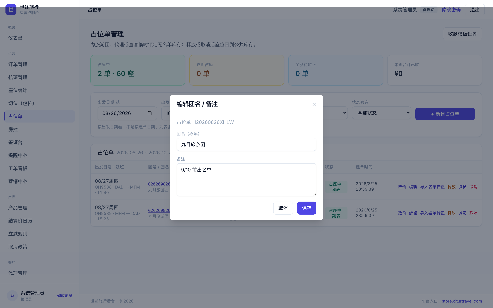
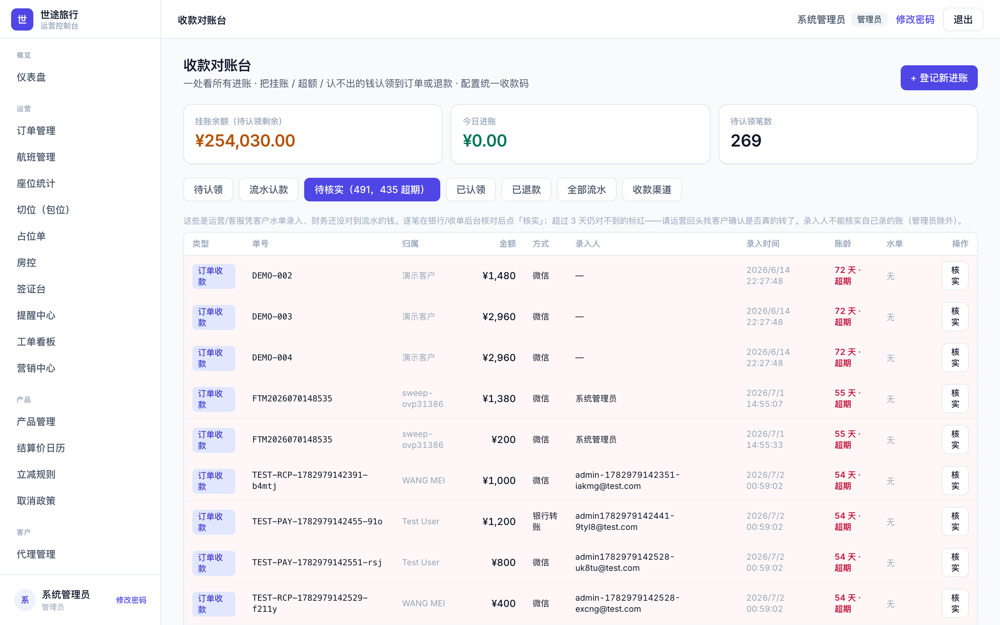
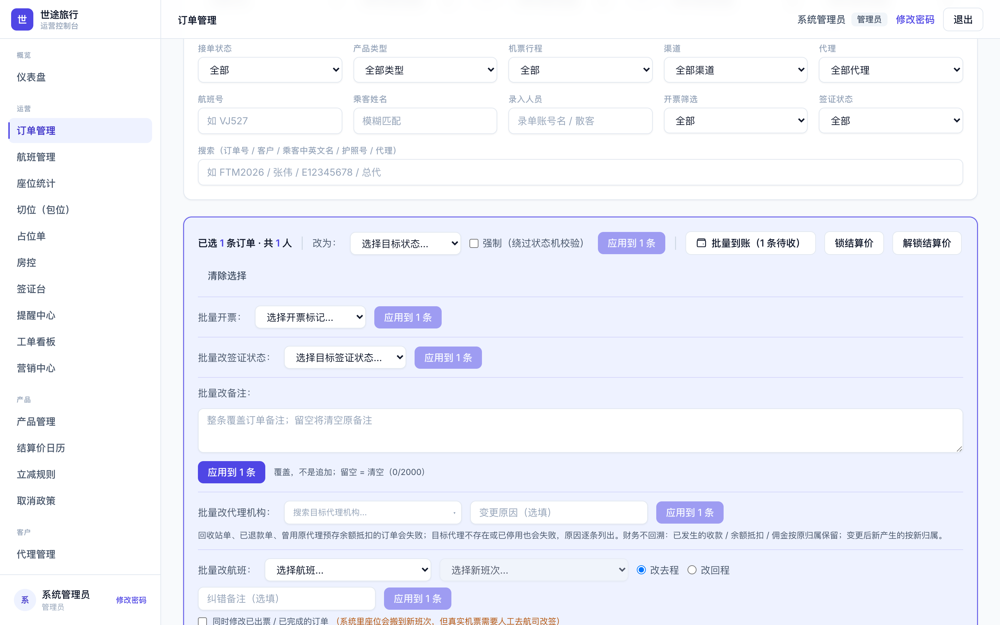

# 本次更新一览

本手册只讲**这次更新的新功能与口径变化**，配合《岗位操作说明》使用。更新已上线后台（2026-08-25）。

| 岗位 | 本次更新要点 |
|---|---|
| 票务 / 操作部 | 占位单大改：团名备注可编辑；手工到账；建单弹窗直接选航段、默认日期防留错；释放自动关期款提醒 |
| 财务 | ⚠️ **收款分「业务已收 / 财务已核实」两态**；对账台新增「待核实」页签（超 3 天标红）；返佣计提规则上线 |
| 运营录单 | 订单批量改备注 / 改代理 / 改航班；代理录单可见结算价；单订酒店支持改期与改结算价 |
| 房控 / 操作部 | 整班机导出新增「房号」「当日余房」两列；全岗总表新增占位单表；座位统计新增「占位」列 |
| 签证岗 | 订单行直接显示代理名与客户备注 |
| 权限 | 航班维护放开运营 / 票务岗；内部员工可给代理账号重置密码 |

---

# 占位单（票务 / 操作部）

## 1. 团名、备注建单后可以改了

占位单列表每行「改价」旁新增「编辑」入口，点开可修改团名和备注，保存即生效。

- 已转正、已释放、已取消的单不能改；
- 直客单团名不允许清空（与建单时「直客必须填团名」同一规则）；
- 备注可以清空。

*占位单列表：每行「改价」旁的「编辑」即为团名/备注编辑入口*

*编辑弹窗预填当前团名和备注，改完保存即生效*

## 2. 手工到账

收到客户/代理的转账水单后，可直接在占位单上录入到账，**不用等财务流水核对完再入账**。财务事后在对账台「待核实」页签逐笔核实（见财务一节）。

## 3. 建单弹窗升级

- 弹窗内直接选航段，团号自动绑定往返，不再依赖列表筛选器决定建单目标；
- 默认日期如当天没有班次，自动回落到最近有班次的那天，避免留错日期；
- 新增航段自动继承上一段舱位，不用每段重选；
- 占位单列表改为跨日期视图。

## 4. 其它改进

- 认款弹窗挂账池为空时给出操作引导，不再是点不动的灰按钮；
- 释放占位单时自动关闭未结的期款提醒，不会再收到已释放单的催款；
- 表单填了一半离开页面会先提醒；触控板横滑不再误触发浏览器后退。

---

# 财务

## 1. 收款「到账双状态」（口径变化，请全体财务知悉）

收款现在分两个状态：

- **业务已收**：业务口凭水单先入账，订单不再被财务流水卡住；
- **财务已核实**：财务在对账台新增的「待核实」页签逐笔核实，超过 3 天未核实自动标红。

防呆规则：录入人不能核实自己录的款（管理员除外）。历史上已成功的收款已自动标记为已核实，**无需任何补操作**。

*收款对账台新增「待核实」页签：角标显示笔数与超期数，逐笔核对银行流水后点「核实」*

## 2. 返佣计提规则上线

- 按**航班起飞日 + 实收金额**计提，套餐单独立成档，费率生效日可提前配置；
- 生效日按北京时间显示，不再差一天；
- 历史订单已一次性补提到位；
- ⚠️ 各代理需在后台把**五档费率**配置齐——未配费率的代理不产生佣金。配置方法见《代理返佣费率配置说明》。

---

# 运营录单

- **批量纠错三件套**：订单支持批量改备注、批量改代理机构、批量改航班，批量录单录错后不用逐单返工；

*订单列表勾选订单后，批量条里依次是批量改备注、批量改代理机构、批量改航班*

- **代理录单可见自家结算价**：单笔和批量提交前都能看到结算价，不再盲录；
- **单订酒店支持改期和改结算价**；
- 订单列表列宽整理：开票、下单时间等列回到默认可视区；
- 批量创单的套餐优惠提示已修正，按价格日历自动取价。

---

# 房控 / 操作部（导出与统计）

- **整班机订单导出新增「房号」「当日余房」两列**：核对当天全员不再需要另开分房表；
- 全岗总表导出新增「占位单」工作表；
- 座位统计页新增「占位」列：余票变少时能直接看到是被哪些占位单占掉的。

---

# 签证岗

- 订单行直接显示代理名和客户备注，不用逐单点进详情。

---

# 权限调整

- 航班维护（新建航班、班次、批量加班次、批量改时刻）放开给**运营岗和票务岗**；
- 内部员工可以给代理账号重置密码（仅限代理账号）。

---

# 配套手册

- 《代理返佣费率配置说明》（五档怎么配、生效日怎么取）
- 《开账号自助指引》（一人一号、实名、按岗位配可见范围）

有问题或用起来不顺手的地方，随时在群里反馈。
